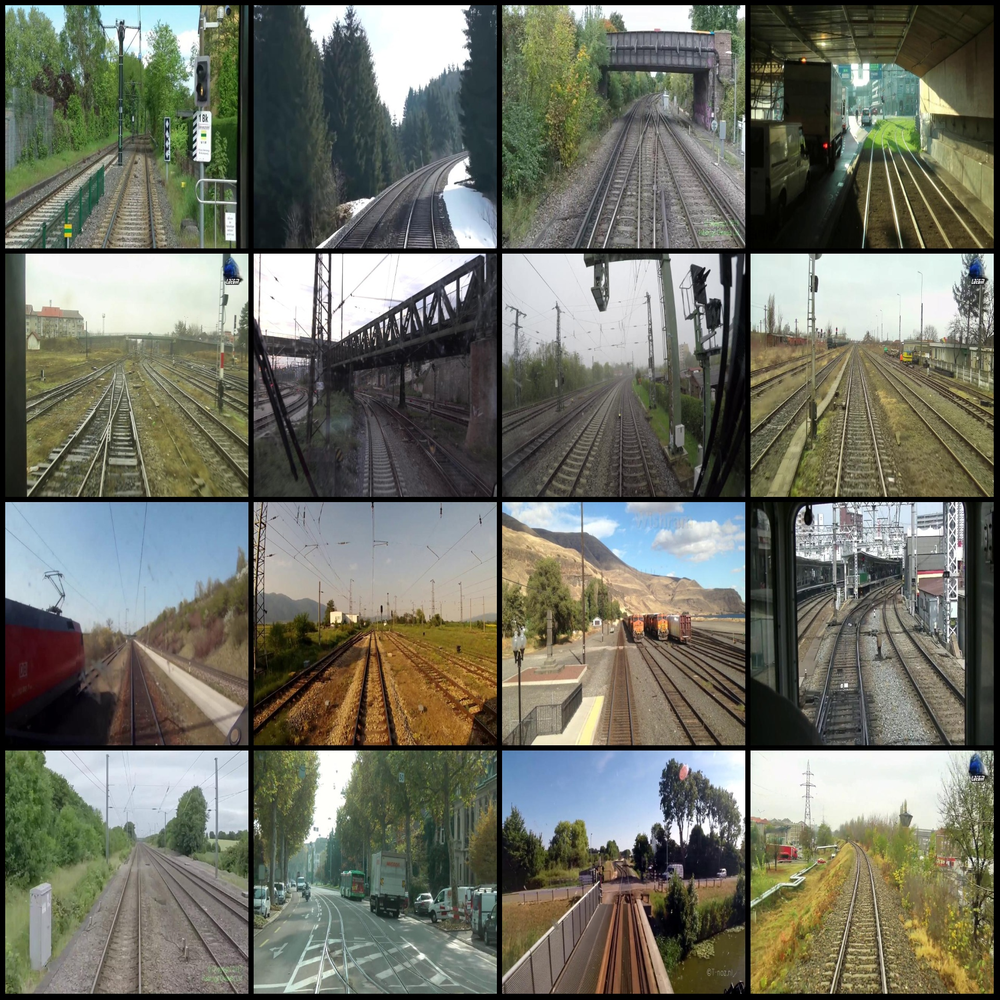
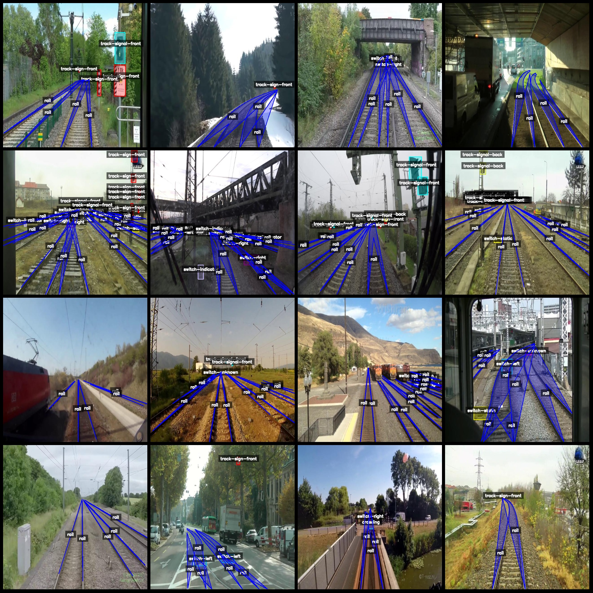
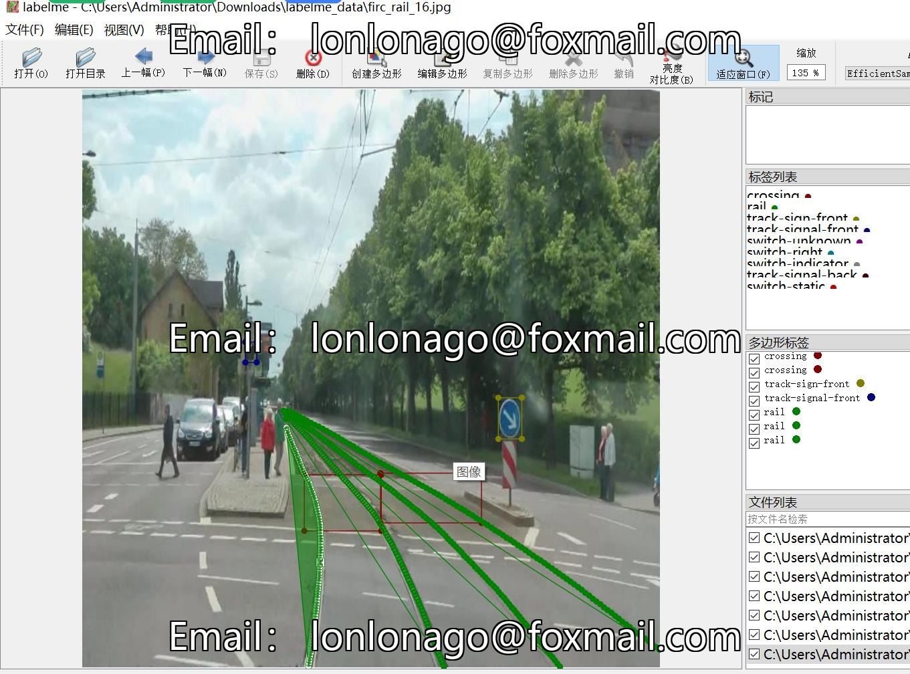
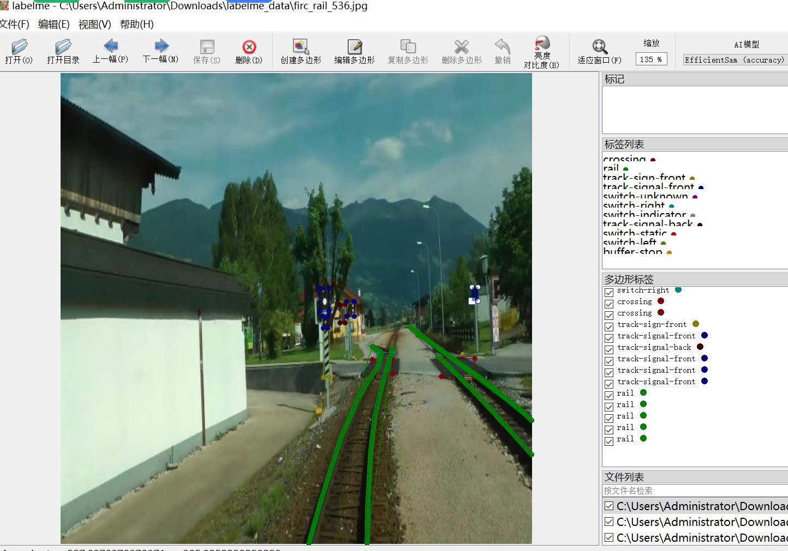

# Intelligent Railway Track Crossing Stops Mechanism Data Set - LabelMe Format: 7238 Images, 11 Categories

The dataset format: labelme (without mask files, only including jpg images and corresponding json files)  
Number of jpg files: 7238  
Number of json files: 7238  
Number of categories: 11  
Category names in json files: ["crossing", "rail", "track-sign-front", "track-signal-front", "switch-static", "switch-unknown", "track-signal-back", "switch-right", "switch-indicator", "switch-left", 
"buffer-stop"]  
Count of bounding boxes for each category:  
crossing (traffic/intersection): count = 2421  
rail (track/railway): count = 42831  
track-sign-front (signal box front): count = 6328  
track-signal-front (signal box front): count = 4899  
switch-static (turning point static): count = 2123  
switch-unknown (turning point unknown): count = 2107  
track-signal-back (signal box back): count = 2915  
switch-right (turning point right): count = 1777  
switch-indicator (turning point indicator): count = 1744  
switch-left (turning point left): count = 1701  
buffer-stop (stop): count = 187  
Total bounding boxes: 69033  
Annotation tool used: labelme version 5.5.0  
Image resolution: 640x640  
Annotation rules: drawing polygons for each category  
Important note: The dataset can be edited using labelme, but the json dataset needs to be converted into mask or yolo or coco format for semantic segmentation or instance segmentation.  
Special declaration: This dataset does not guarantee any accuracy in the training models or weight files.  
Image preview:  
Annotation example (select 16 images at random):  
Annotation drawing results:  
Labelme editing example:
## Images

Here is a pay link on Stripe ( https://buy.stripe.com/3cs8yP7sY87d0vu9AB ). Please contact me lonlonago@foxmail.com after funding $89, and I will send you a complete data files , thank you!

